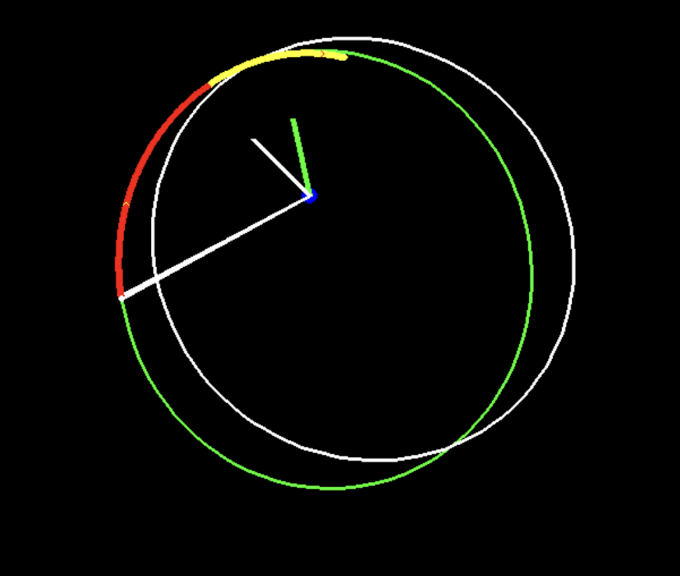

# Hohmann Orbit Transfer with Reinforcement Learning

Run the following to play the game or watch the agent play it:

```bash

python3 game.py

python3 game_with_agent.py

```

<p align="center">
  
</p>

> Example visualization of the RL agent attempting
> to go from starting orbit to the target orbit. The red trail is
> past positions of rocket. The yellow in the trail are places where
> thrust was used. Red is the predicted orbit based on the current state of the rocket.
> The white line is the target orbit.

<p align="center">
  
</p>

> Visualization of the flight trajectory, the trajectory over time in the reward space, reward over time, as well as the other state tuple values throughout the trajectory are plotted as a function of time steps taken.

<p align="center">
  
</p>

> Visualization of Reward function. The black dots are a sample of initial states the model starts out at. Highest reward is earned when there is no difference between semi-major axis length and eccentricity of the target and current orbits

<p align="center">
  
</p>

> Sampling of orbits used to train the agent. Because they were all made to be tangent to the initial orbit at some point, the agent would only need one prograde burn to reach its target.
